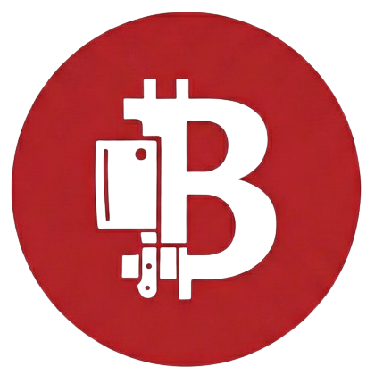
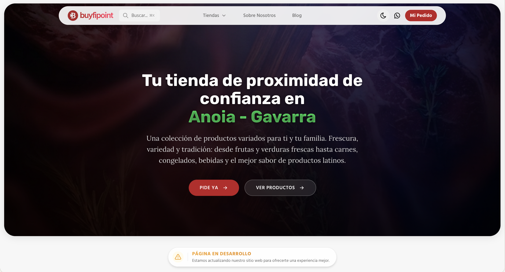

  

<h1 align="center">Buyfipoint</h1>
<h3 align="center">Buy products with Fidelity</h3>

Buyfipoint es la marca bajo la que se gestionan tiendas de alimentación de proximidad
y servicios para el barrio. Hoy: la tienda de Anoia - Gavarra y un punto Amazon Hub Delivery.

  

## Qué hay hoy

| | |
|---|---|
| [www.buyfipoint.com](https://www.buyfipoint.com) | El sitio de la marca: presenta la tienda y recoge mensajes de contacto. |
| [admin.buyfipoint.com](https://admin.buyfipoint.com) | El panel interno con el que se llevan proveedores, productos, pedidos, contabilidad y tributación de cada negocio. Acceso restringido. |

## Hacia dónde va

La idea que da nombre a la marca —comprar con fidelidad: puntos, promociones y pedidos
desde la web— es el objetivo, no algo que exista todavía.
